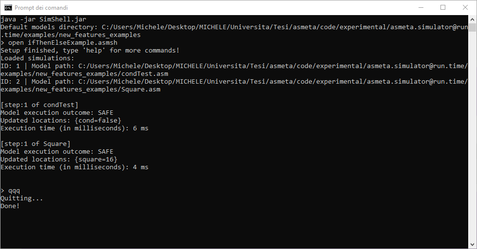
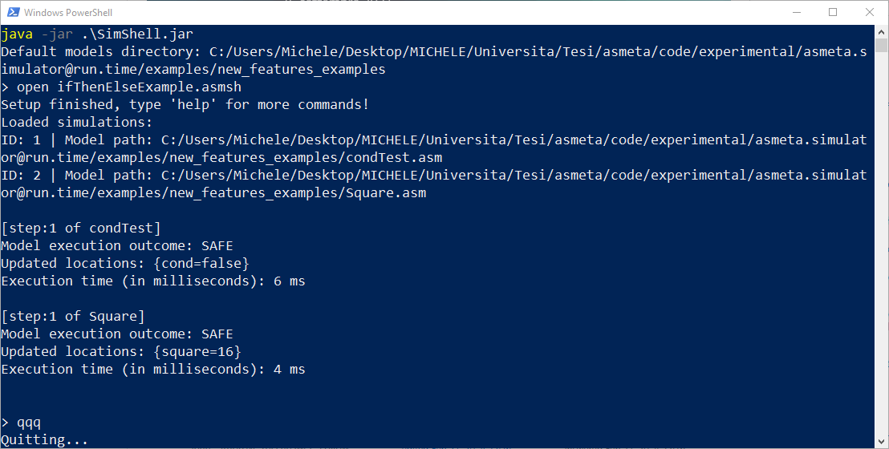

# How to use SimShell from command line

## Requirements
* Java JDK >= 15.0.2 or equivalent OpenJDK

You can install it in Linux (Debian/Ubuntu) with:
```bash
sudo apt install openjdk-16-jre-headless
```
**Important note:** you need to manually update the `.config` file inside the `SimShell.jar` archive (path: `org/asmeta/runtime_commander/`) with your default models directory to make all the commands work properly.
## Windows (tested on Windows 10)
### Command prompt
1. Locate the `SimShell.jar` executable jar file in your file system; its default location in the ASMETA repository is: `asmeta/code/experimental/asmeta.simulator@run.time/jars/`

2. Open a command prompt inside the `SimShell.jar` file's directory
3. Run: `java -jar SimShell.jar` to open the Command Line Tool interface for the AsmetaS@run.time *or*

    run: `java -jar SimShell.jar <command> [<args>]` to directly execute a supported command.

#### Example:
```
java -jar SimShell.java open multipleRun.asmsh
```

**Important note:** the `config` command is not supported in this configuration, due to the immutability of the jar archive. The configuration file `.config` can be edited manually and saved inside `SimShell.jar`, it is located in: `org/asmeta/runtime_commander/`


### PowerShell
1. Locate the `SimShell.jar` executable jar file in your file system; its default location in the ASMETA repository is: `asmeta/code/experimental/asmeta.simulator@run.time/jars/`

2. Open a PowerShell inside the `SimShell.jar` file's directory
3. Run: `java -jar .\SimShell.jar` to open the Command Line Tool interface for the AsmetaS@run.time *or*

    run: `java -jar .\SimShell.jar <command> [<args>]` to directly execute a supported command.

#### Example:
```PowerShell
java -jar .\SimShell.java open multipleRun.asmsh
```

**Important note:** the `config` command is not supported in this configuration, due to the immutability of the jar archive. The configuration file `.config` can be edited manually and saved inside `SimShell.jar`, it is located in: `org/asmeta/runtime_commander/`



## Linux (tested on WSL2 - Ubuntu 20.04.2)
1. Locate the `SimShell.jar` executable jar file in your file system; its default location in the ASMETA repository is: `asmeta/code/experimental/asmeta.simulator@run.time/jars/`

2. Open a Linux terminale inside the `SimShell.jar` file's directory
3. Run: `java -jar SimShell.jar` to open the Command Line Tool interface for the AsmetaS@run.time *or*

    run: `java -jar SimShell.jar <command> [<args>]` to directly execute a supported command.

#### Example:
```bash
java -jar SimShell.java open multipleRun.asmsh
```

**Important note:** the `config` command is not supported in this configuration, due to the immutability of the jar archive. The configuration file `.config` can be edited manually and saved inside `SimShell.jar`, it is located in: `org/asmeta/runtime_commander/`

")