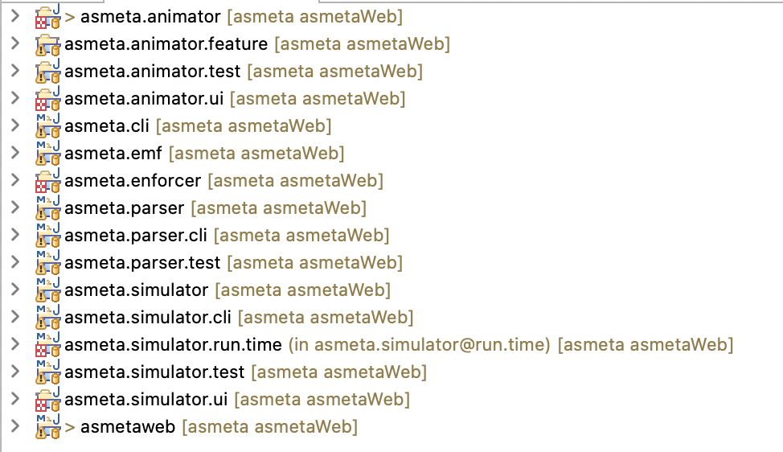

# Asmeta Web App


This project expose the Simulator@Runtime functionality through a Spring Backend and a HTML5 Frontend.

## Backend Setup

The backend is builded with Spring Boot Framework version 3.2.0.

It need differents dependencies from the Asmeta project:



In the pom.xml file is explicited the **asmeta.simulator.run.time** dependency, but you need to add **asmeta.animator** in the Java Build Path to make it run.

There is also a API documentation thanks to Swagger, reachable at http://localhost:8080/swagger-ui/index.html

## Frontend Setup

The frontend is builded with HTML5, CSS and plain Javascript.
In addition it's used Wepback in order to compress and build the code.

The dependencies are all tracked in the package.json file, and in order to install  dependencies run the command:

```bash
    npm install
```

To build and test in a local machine with hot reload functionality:
```bash
    npm run dev
```

To build and deploy in a production enviroment:
```bash
    npm run build
```
## Authors

- [@Lucio Marco Maranta](https://www.github.com/luciomarcomaranta)